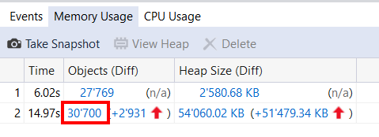

# DWX2016: Troubleshooting WPF Applications Lab 

Dieses Repository enthält folgende Labs:

# WPF Timeline Tool

[WPF Timeline Tool/Lab.md](WPF Timeline Tool/Lab.md)

Untersuchen eines Layoutprozesses mit dem WPF Timeline Tool

# WPF Performance Suite

[WPF Performance Suite/Lab.md](WPF Performance Suite/Lab.md)

Gehen sie ihren Problemen mit der WPF Performance Suite auf den Grund

## WPF Memory Leaks

[WPF Memory Leaks/Lab.md](WPF Memory Leaks/Lab.md)

Untersuchung von Memory Leaks mit dem Diagnostic Tools Window

## VS2015 Crash Dump Analysis

[VS2015 Crash Dump Analysis/lab.md](VS2015 Crash Dump Analysis/Lab.md)

Analysieren Sie anhand eines Memory Dumps vom Kunden in Visual Studio 2015, was für eine Exception zum Absturz geführt hat.

