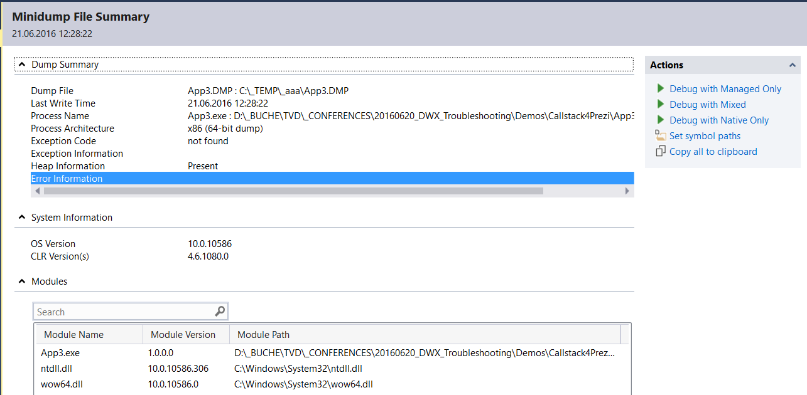
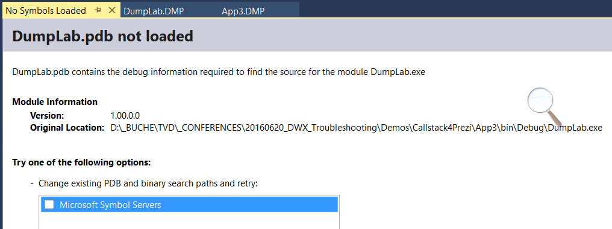
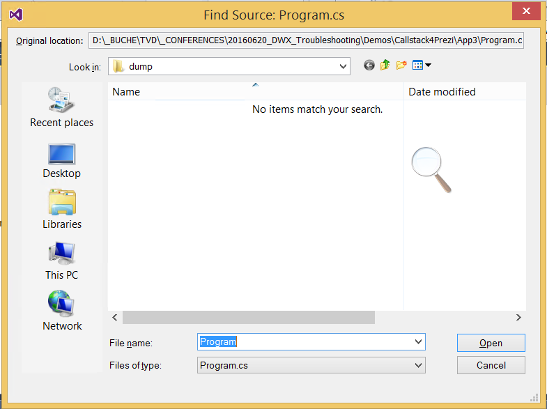
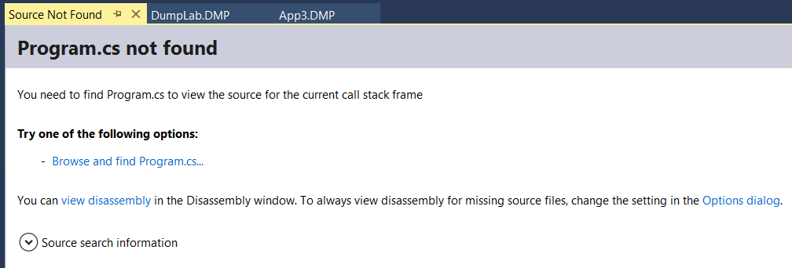

# Lab Visual Studio Crash Dump Debugging

## Lab 1: Post-Mortem Exception Analyse

Stellen Sie sich folgendes Szenario vor. Ihre WPF-Anwendung läuft beim Kunden und von einem Tag auf den anderen Startet die nicht mehr. 

Debugging ist auf dem produktiven System leider nicht möglich, LogFile gibts keins und im Event Log steht auch nix schlaues.

Zum Glück kennen Sie sich aus und können dem Kunden erklären, wie er von dem hängenden Prozess mit dem Windows Task Manager einen Memory Dump erstellen kann. Dieser Dump wird ihnen zur Verfügung gestellt:

\Lab1\Dumplab.DMP

Jetzt geht es darum herauszufinden, warum dass der Prozess abstürzt. Öffnen Sie dafür eine neue Instanz von Visual Studio 2015 und öffnen Sie den Dump mit **File -> Open -> File**

Die folgende Seite zeigt grundlegende Informationen zum Dump an. In der **Modules** Liste sehen sie, welche Module (= Assemblies) in den Speicher geladen wurden. 

Klicken sie auf **Debug with Managed Only** um eine debugging session zu starten.

Schauen Sie sich die **Call Stack** und **Locals** Fenster an. Finden sie heraus, was für eine Exception aufgetreten ist?

## Lab 2: Symbole hinzufügen

Der Kunde hat ihnen vom produktiven System neben dem Dump auch das passende Symbol File (*.PDB) zur Verfügung gestellt. Die Symboldatei enthält unter anderem die Verknüpfung von IL-Code zu C#-Code. Das heisst nur mit dem Symbolfile kann der Debugger im Callstack die Zeilennummern anzeigen. 

Wenn das Visual Studio keine passende PDB Datei findet, dann wird die folgende Fehlermeldung (**No Symbols Loaded**) angezeigt:

Der Callstack kann trotzdem angeschaut werden, enhält aber keine Angaben zu Zeilennummern und Codedateien.

Benutzen sie die **No Symbols Loaded** Seite um den Pfad zur PDB Datei anzugeben.

Sobald VS die Symbole geladen hat, sucht es nach der Datei Program.cs. Da diese nicht vorhanden ist wird ein File Dialog angezeigt, in welchem die Datei **Program.cs** angegeben werden kann:

Klicken Sie hier auf abbrechen. 
Schauen Sie sich den Callstack nochmals an. Es sind jetzt Zeilennummern ersichtlich.

## Lab 3: Source Code angeben.

Die Seite **Source not found** zeigt an, dass die Klasse Program.cs nicht gefunden wurde. 

Klicken sie auf **Browse and find Program.cs** und geben sie den Pfad zur Program.cs Datei an.

Gehen Sie zurück in den Callstack. Sie haben jetzt die Möglichkeit durch Doppelklick auf den Callstack in den Source Code hineinzuspringen.