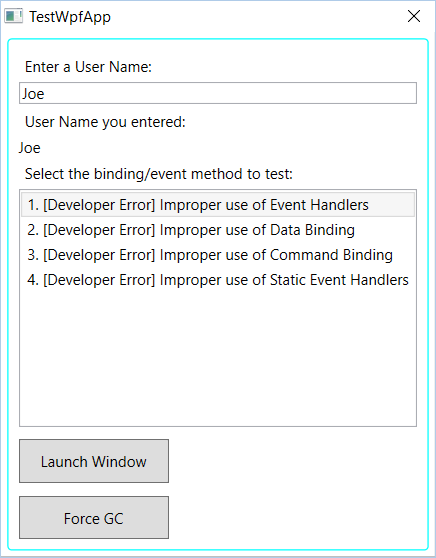
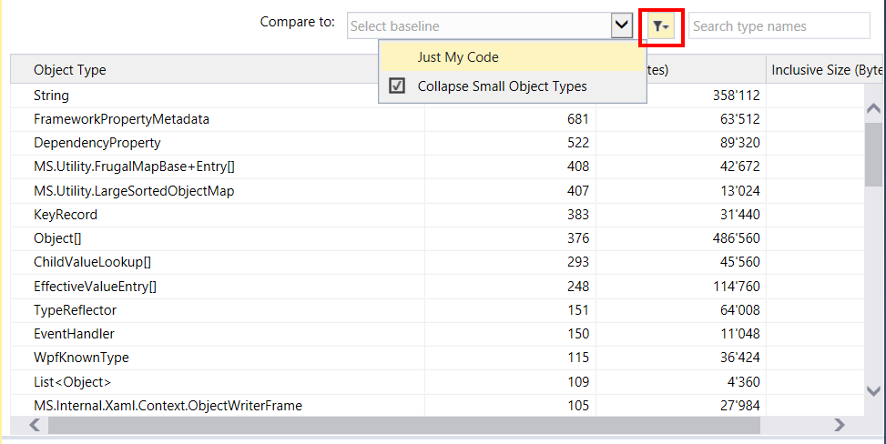
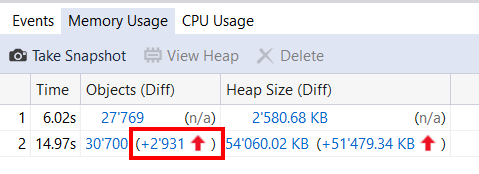

# Lab WPF Memory Leaks

Alle credits für die TestApp gehen an Jossef Goldberg. Die Details zur App inklusive Erklärung aller Leaks gibts unter:

https://blogs.msdn.microsoft.com/jgoldb/2008/02/04/finding-memory-leaks-in-wpf-based-applications/

Hinweis: Die Leaks, welche mit .NET 4.0 geschlossen wurden sind nicht mehr in der App enthalten.

# Aufgaben

## Lab 1: WPF mit Memory Leak 

Öffnen Sie die Solution **MemoryLeaks** in Visual Studio 2015.

Starten sie die Anwendung und öffnen sie das **Diagnostic Tools Window**. Beobachten sie im Diagnostic Tools Windows den Speicherverlauf. 

Wählen sie einen der Einträge und öffnen Sie ein Paar Fenster um diese gleich wieder zu schliessen.

Simulieren Sie mit einem Klick auf den **Force GC** Knopf eine Garbage Collection.

Falls der Speicher trotz geschlossenen Fenstern nicht wieder sinkt, haben sie ein Memory Leak entdeckt!

## Lab 2: WPF ohne Memory Leak

Wiederholen sie die Aufgabe aus Lab1. Aktivieren sie dieses Mal in jedem Fenster, das sie öffnen die "Clear..." checkbox. Diese stellt sicher, dass die Referenzen beim schliessen des Fensters korrekt aufgelöst werden.

Simulieren Sie mit einem Klick auf den **Force GC** Knopf eine Garbage Collection.

Der Garbage Collector sollte den Speicher freigeben können, was sich in einer reduktion auf den Anfangsstand bemerkbar macht. 

## Lab 3: Analyse des Memory Leaks

Starten sie die Anwendung neu und beobachten sie das Diagnostic Tools Fenster.

Klicken sie auf **Take Snapshot**

Öffnen sie drei Fenster und schliessen sie diese wieder.

Klicken sie erneut auf **Take Snapshot**

Halten sie den Debugger über den **pause** Knopf an.

Klicken sie auf den markierten Wert in der **Objects** Spalte vom zweiten Snapshot um die Heap View zu öffnen.

Benützen sie die Filter um 

Spielen sie mit den Filtern um nach **Just my Code** und **Small Objects** zu filtern.

Schauen sie sich die Einträge an und finden sie die problematischen Fenster. Benützen sie **Show Instances** aus dem Kontextmenü um die einzelnen Instanzen anzuzeigen.

Schauen sie sich die **Path to root** Angaben an um herauszufinden, was die Entsorgung der Objekte verhindert.

## Lab 4: Memory Snapshot Diffs

Öffnen sie ein Diff-Fenster, indem sie auf die markierte Zahl klicken.

Schauen sie sich die Veränderung in der Heap View an!