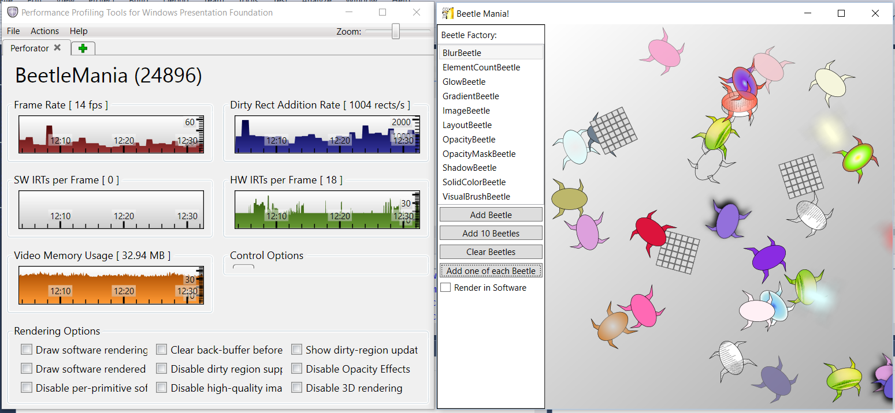
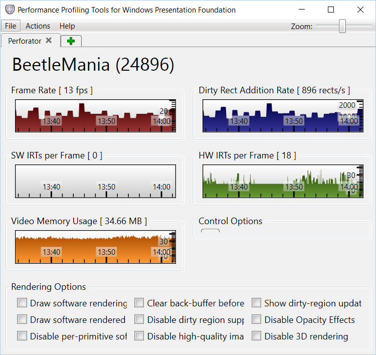
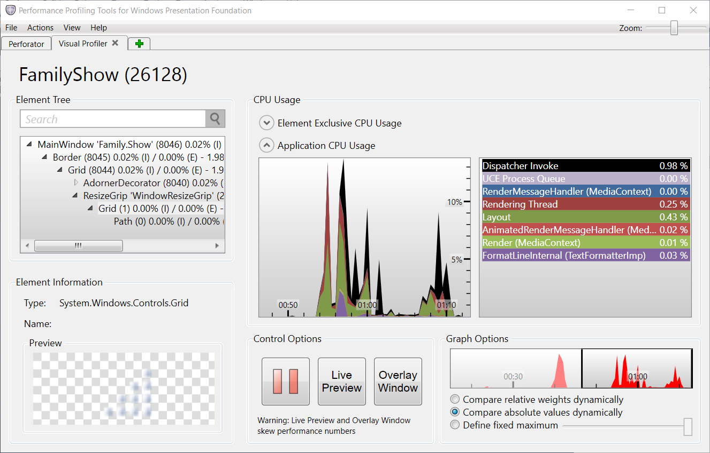
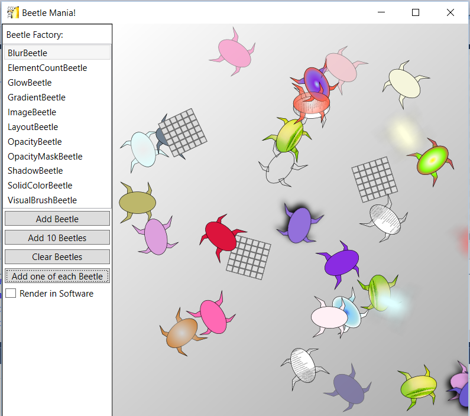

# Lab WPF Performance Suite

Die WPF Performance Suite ist im Microsoft Windows SDK v7.1 enthalten. Sie funktioniert aber ebenfalls auf höheren Versionen von Windows. 

Die WPF Performance Suite enthält zwei Tools für die Analyse von WPF Anwendungen:

* Perforator - Für die Analyse des Renderingverhaltens
* Visual Profiler - Für die Analyse von Layoutprozessen im Visual Tree

Perforator:

Visual Profiler:

**Hinweis**

Der Visual Profiler zeigt für alle Elemente aus dem Visual Tree die fürs Layout benötigte Zeit an. Er ist aber in der Benutzung eher umständlich. Darum wird für die Analyse von Layoutprozessen das WPF Timeline Tool aus Visual Studio empfohlen. Das folgende Lab konzentriert sich auf den Perforator.

Des weiteren ist eine Demo-Anwendung enthalten:

* BeetleMania

Beetle Mania

# Installation

1. Installieren Sie die WPF Performance Suite mit dem entsprechenden Installer: **Win7PerformanceTools_wpt_x86.msi** oder **Win7PerformanceTools_wpt_x64.msi**
2. Installieren Sie den TimeZone Patch **Win7PerformanceTools_WpfPerf_timezone_patch.msp**
3. Die **WPF Performance Suite** ist jetzt im Startmenü verfügbar

Wenn die Suite gestartet ist kann mit "File -> Add Tool" der Perforator hinzugefügt werden. Danach kann mit "Actions -> Select Process" ein Prozess ausgewählt oder mit "Actions -> Launch Process" ein neuer gestartet werden.  

# Aufgaben

## Vorbereitung

Überfliegen sie die Anleitung der WPF Performance Suite:

DE: https://msdn.microsoft.com/de-de/library/aa969767(v=vs.110).aspx

EN: https://msdn.microsoft.com/en-us/library/aa969767(v=vs.110).aspx

## Lab 1: Dirty Rectangle Algorithmus

Erstellen sie eine Handvoll beliebiger Käfer, so um die 10 Stück. Beobachten sie die Parameter im Perforator. 

**1.1 Render in Software**

Schalten Sie in Beetle Mania auf "Render in Software" um und beobachten sie dein Einfluss auf die Metriken.

Welche Variante bietet die höhere Framerate?

**1.2 Dirty Rectangles**

Schalten sie im Perforator die Option "Show dirty-region update Overlay" ein. Es werden nun die Dirty Rectangles angezeigt, welche die WPF berechnet hat.

## Lab 2: Der Einfluss von Effekten

Erstellen Sie Beetles, die einen Effekt haben (Blur, Opacity, Shadow). 

Wie viele Beetles verträgt ihr Rechner?

Wie verhält es sich wenn Software Rendering aktiviert wird?

## Lab 3: Viel Lärm um nichts?

Entfernen sie alle Käfer mit dem **Clear Beetles** Knopf.
Schauen Sie sich die aktuelle "Dirty Rect Addition Rate an". 

Die WPF arbeitet, im Gegensatz zu WinForms ("Immediate Mode") in einem "Retained Mode". Dies bedeutet, dass sämtliche Objekte, welche gerendert werden sollen anstatt auf den Bildschirm zuerst in einen Buffer gezeichnet werden. Diese Pufferung ist die Grundlage für viele WPF Effekte wie Transparenz oder Animationen. 

Man spricht auch davon, dass die WPF, was das Rendern von Inhalten auf dem Bildschirm angeht, "intelligent" ist. Diese Intelligenz äussert sich zum Beispiel darin dass die WPF nichts auf den Bildschirm zeichnet, wenn es nichts zu zeichnen gibt. 

Zurück zu den Käfern: Obwohl das Canvas leer ist, können wir eine "Dirty Rect Addition Rate" feststellen, die grösser als 0 ist. 

Benützen sie die Tools aus dem Perforator um herauszufinden, weshalb eine positive "Dirty Rect Addition Rate" vorhanden ist.

